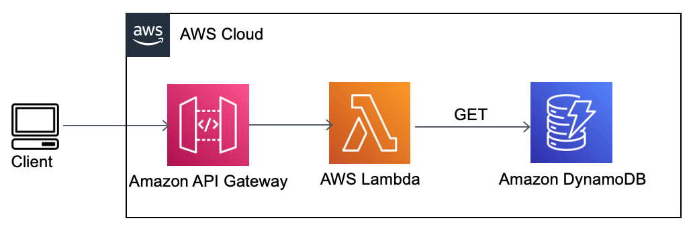

## DynamoDB-to-customer pipeline

Purchases informaiton was [previously configured](https://github.com/ksenia-tabakova/AWS-pipelines-project/tree/main/Kinesis-to-DynamoDB%20pipeline) to be stored in Invoices table on DynamoDB.

To enable possibility for customers to retrieve information on their purchases, API Gateway GET method with [lambda integration](https://github.com/ksenia-tabakova/AWS-pipelines-project/blob/main/data-ingestion-pipeline/lambda_function.py) was added.

