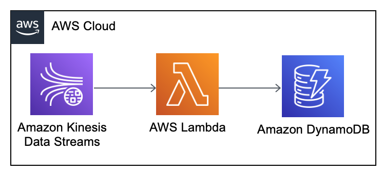

# Kinesis to DynamoDB pipeline

1. Two tables in DynamoDB were created with the console:
- Customers - CustomerID as primary key, InvoiceNo stored in attributes
- Invoices - InvoiceNo as primary key, invoice data stored in attributes
2. [Lambda function](https://github.com/ksenia-tabakova/AWS-pipelines-project/blob/main/Kinesis-to-DynamoDB%20pipeline/lambda_function.py) triggered by Kinesis Stream event writes data two these two tables

AWS diagram:

