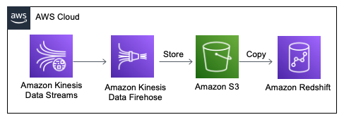

## Kinesis stream to Redshift pipeline

### Pipeline description

1. Kinesis Firehose Delivery Stream connects to the Kinesis data stream.
2. Firehose writes data to the interim S3 bucket.
3. Firehose copies data from S3 bucket to the Redshift database.

### Setting it up
1. Redshift database was configured in the console.
2. Table in the database was created using query (code [here](https://github.com/ksenia-tabakova/AWS-pipelines-project/blob/main/Kinesis-to-Redshift%20pipeline/create_table_query.txt))
3. Interim S3 bucket was configured with the console. 
4. [jsonpaths.json](https://github.com/ksenia-tabakova/AWS-pipelines-project/blob/main/Kinesis-to-Redshift%20pipeline/jsonpaths.json) file was placed in the bucket - it tells Firehose what is the structure of the records coming in.
5. Amazon Kinesis Firehose Delivery Stream configured and connected to the Redshift database and table in the console, with intermediate S3 bucket created in step 3.

AWS diagram:

