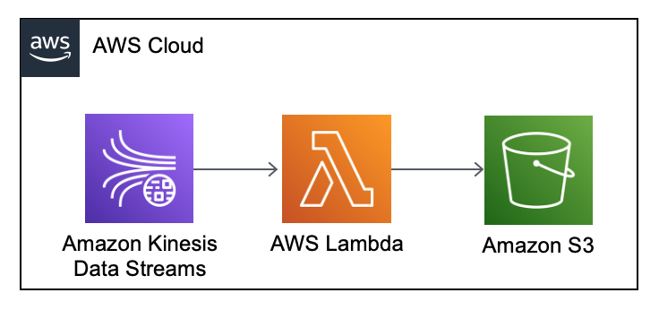

### Pipeline description

1. S3 bucket configured in the console
2. Lambda funciton is triggered by Kinesis Stream event
3. Data parsed to the S3 bucket
 
[Lambda function](https://github.com/ksenia-tabakova/AWS-pipelines-project/blob/main/Kinesis-to-S3%20pipeline/lambda_function.py).

