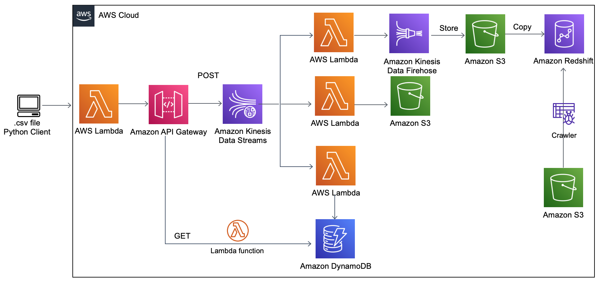

# AWS-pipelines-project
### Project in brief

This is a semi-guided project from [Learn Data Engineering online academy](https://learndataengineering.com/) to build pipelines using AWS services.

The project has three main goals:
1. Process and store transactions
2. Give customers access to their purchase data
3. Provide data on transaction for BI

### Pipelines
Following pipelines were built:

1. [Ingestion pipeline: local machine to API Gateway](https://github.com/ksenia-tabakova/AWS-pipelines-project/tree/main/data-ingestion-pipeline)
2. [Kinesis Data Stream to S3 raw storage](https://github.com/ksenia-tabakova/AWS-pipelines-project/tree/main/Kinesis-to-S3%20pipeline)
3. [Kinesis Data Stream to DynamoDB](https://github.com/ksenia-tabakova/AWS-pipelines-project/tree/main/Kinesis-to-DynamoDB%20pipeline)
4. [DynamoDB to client](https://github.com/ksenia-tabakova/AWS-pipelines-project/tree/main/DynamoDB-to-customer%20pipeline)
5. [Kinesis to Redshift](https://github.com/ksenia-tabakova/AWS-pipelines-project/tree/main/Kinesis-to-Redshift%20pipeline)
6. [Batch processing pipeline](https://github.com/ksenia-tabakova/AWS-pipelines-project/tree/main/batch%20processing%20pipeline)

AWS Diagram:

