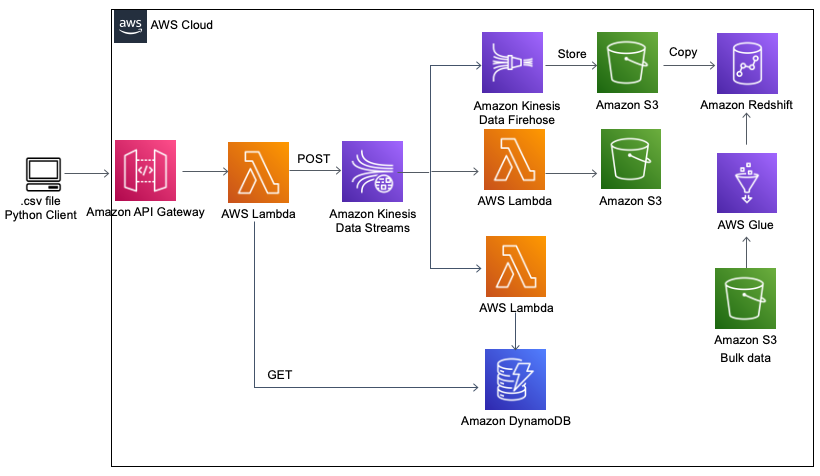

# AWS-pipelines-project

This is a guided project from [Learn Data Engineering online academy](https://learndataengineering.com/) to build pipelines using AWS services

Pipelines:
1. [Ingestion pipeline: local machine to API Gateway](https://github.com/ksenia-tabakova/AWS-pipelines-project/tree/main/data-ingestion-pipeline)
2. [Kinesis Data Stream to S3 raw storage](https://github.com/ksenia-tabakova/AWS-pipelines-project/tree/main/Kinesis-to-S3%20pipeline)
3. [Kinesis Data Stream to DynamoDB](https://github.com/ksenia-tabakova/AWS-pipelines-project/tree/main/Kinesis-to-DynamoDB%20pipeline)
4. [Kinesis to Redshift]()
5. [Batch processing pipeline]()

AWS Diagram:

