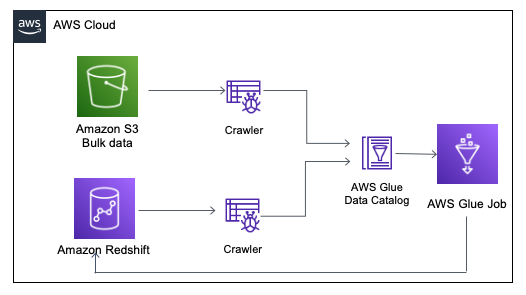

## Batch processing pipeline

The purpose of this pipeline is to do bulk import into the the Redshift database.
AWS Glue service is used to enable this pipeline.

Setting it up:
1. Created table in the Redshift for the incoming batch data
2. Created AWS Glue Database
3. Two crawlers created:
 -  to crawl over S3 bucket and output to the AWS Glue database
 -  to crawl over Redshift table and output results to the AWS Glue database
4. AWS Glue job (in Spark and Python) was created: 
 -  source : AWS Glue Database Table populated with crawler
 -  tagret: Redshift Database
 [Glue job script](https://github.com/ksenia-tabakova/AWS-pipelines-project/blob/main/batch%20processing%20pipeline/glue_job.py)

AWS diagram:

