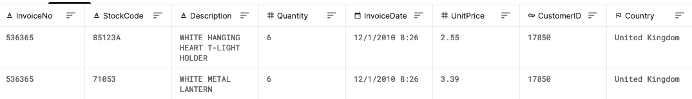
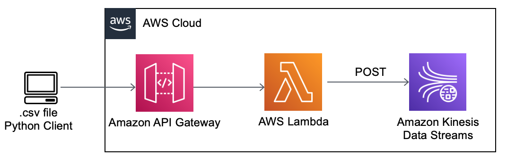

### Data source and description
E-commerce data from an UK retailer (available on Kaggle [here](https://www.kaggle.com/carrie1/ecommerce-data)) was used for this project. It contains information on purchases done by customers.

### Pipeline
1. CSV data entries were transfromed to json strings in the Client and sent to API Gateway. ([Code](https://github.com/ksenia-tabakova/AWS-pipelines-project/blob/main/data-ingestion-pipeline/ingestion-script.py))
2. Simple API Gateway that has two methods (POST AND GET, see more on use of GET method in this project [here](https://github.com/ksenia-tabakova/AWS-pipelines-project/tree/main/DynamoDB-to-customer%20pipeline)) with Lambda integration was created.
3. POST method writes data to Kinesis Stream that was configured in the console.
Lambda function [code](https://github.com/ksenia-tabakova/AWS-pipelines-project/blob/main/data-ingestion-pipeline/lambda_function.py)

AWS Diagram:

